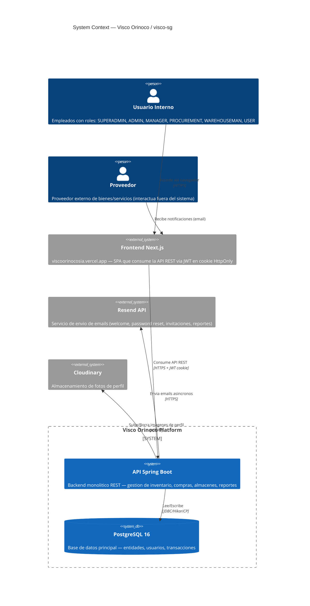
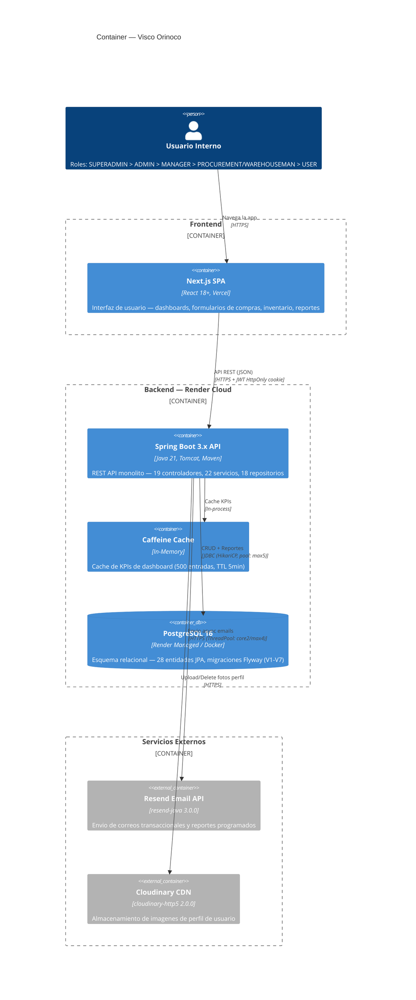
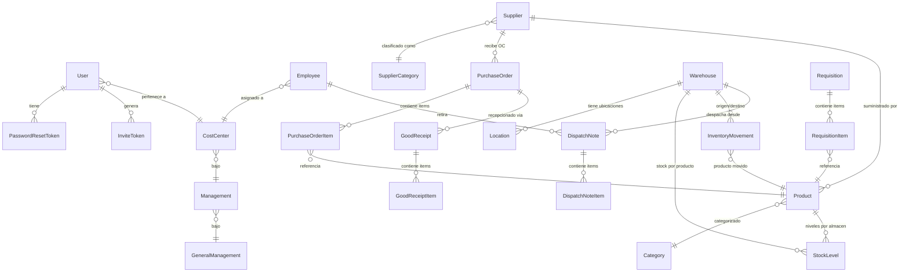

# Visco Orinoco (visco-sg) — C4 Model Architecture Diagrams

## C1 — System Context



---

## C2 — Container Diagram



---

## C3 — Component Diagram (Spring Boot API Internals)

```mermaid
C4Component
    title Component — Spring Boot API

    Container_Boundary(api, "Spring Boot API") {

        Component(security, "Security Layer", "Spring Security + Bucket4j", "JWT Auth Filter, Rate Limit Filter (14 rutas), CORS, Role Hierarchy (6 roles)")
        Component(jwt, "JwtService", "jjwt 0.12.6", "Genera/valida tokens HMAC-SHA256, expiracion configurable (default 24h)")
        Component(cookie, "CookieService", "", "HttpOnly + Secure + SameSite=None cookie visco_auth_token")

        Component(auth_ctrl, "AuthController", "REST", "/api/auth/* — register, login, logout, forgot/reset-password, me")
        Component(auth_svc, "AuthService", "", "Registro (con invite token + Cloudinary upload), login, refresh")
        Component(pwd_svc, "PasswordResetService", "", "Generacion y consumo de tokens de reset de password")
        Component(invite_svc, "InviteTokenService", "", "Tokens de invitacion de un solo uso para registro")

        Component(admin_ctrl, "AdminController + UserController", "REST", "/api/admin/*, /api/users/* — CRUD usuarios, activar/desactivar/borrar, foto perfil")
        Component(admin_svc, "AdminService", "", "Gestion completa de usuarios, conteo de referencias, soft/hard delete")

        Component(supplier_ctrl, "SuppliersController", "REST", "/api/suppliers/*, /api/supplier-categories/* — CRUD, soft-delete, metricas desempeno")
        Component(supplier_svc, "SupplierService + SupplierCategoryService", "", "Gestion de proveedores con representantes legales, monedas, categorias")

        Component(product_ctrl, "ProductController + CategoryController", "REST", "/api/inventory/products/*, /api/inventory/categories/* — CRUD, CSV import, busqueda")
        Component(product_svc, "ProductService + CategoryService", "", "Productos con 48 UoMs, categorias jerarquicas, soft-delete")

        Component(proc_ctrl, "ProcurementController", "REST", "/api/procurement/orders/* — CRUD + flujo de estados de OC")
        Component(proc_svc, "ProcurementService", "", "Ordenes de compra: PENDING → APPROVED → IN_TRANSIT → DELIVERED, conversion desde requisiciones")

        Component(req_ctrl, "RequisitionController", "REST", "/api/requisitions/* — CRUD + flujo de estados de requisiciones")
        Component(req_svc, "RequisitionService", "", "Requisiciones: DRAFT → PENDING → APPROVED → CONVERTED (a OC)")

        Component(wh_ctrl, "WarehouseController + LocationController", "REST", "/api/warehouse/*, /api/warehouse/locations/* — CRUD, transferencias, ajustes, recepciones, despachos")
        Component(wh_svc, "WarehouseService + LocationService", "", "Stock levels (optimistic locking), kardex de movimientos, good receipts contra OC, dispatch notes")

        Component(inv_ctrl, "InvoiceController", "REST", "[ELIMINADO]")
        Component(inv_svc, "InvoiceService", "", "[ELIMINADO]")

        Component(dash_ctrl, "DashboardController", "REST", "/api/dashboard/* — KPIs cacheados en Caffeine")
        Component(stats_svc, "StatsService", "", "Metricas: total OC, unidades inventario, gasto mensual, fulfillment rate, critico/sobrestock")

        Component(emp_ctrl, "EmployeeController + CostCenterController + ManagementController + GeneralManagementController", "REST", "CRUD empleados, centros de costo, gerencias")
        Component(emp_svc, "EmployeeService + CostCenterService + ManagementService + GeneralManagementService", "", "Estructura organizacional: GeneralManagement → Management → CostCenter → Employee")

        Component(report_ctrl, "ReportController", "REST", "/api/reports/* — CRUD reportes, programados, templates, analiticas, descarga")
        Component(report_svc, "ReportService + ReportGeneratorService + ExcelExportService + PdfExportService", "", "Generacion de reportes STOCK/MOVEMENT/ALERT/PURCHASE/FINANCE/WAREHOUSE — PDF (iText+JFreeChart) y Excel (Apache POI)")

        Component(email_svc, "EmailService + ResendEmailService", "Async", "Envio asincrono via Resend API + SMTP fallback, welcome, reset, invite, reportes")
        Component(scheduled_svc, "ScheduledReportService + WeeklyReportService", "Cron", "Reporte semanal (Lunes 8AM) + verificacion horaria de reportes programados")

        Rel(security, jwt, "Valida token JWT en cada request", "")
        Rel(jwt, cookie, "Extrae token de cookie HttpOnly", "")

        Rel(auth_ctrl, auth_svc, "", "")
        Rel(auth_svc, pwd_svc, "Flujo forgot/reset password", "")
        Rel(auth_svc, invite_svc, "Registro con invite token", "")
        Rel(auth_svc, email_svc, "Envia welcome/reset/invite emails", "Async")

        Rel(admin_ctrl, admin_svc, "", "")
        Rel(admin_svc, auth_svc, "CRUD usuarios", "")

        Rel(supplier_ctrl, supplier_svc, "", "")
        Rel(product_ctrl, product_svc, "", "")
        Rel(proc_ctrl, proc_svc, "", "")
        Rel(proc_svc, req_svc, "Convierte requisicion → OC", "")
        Rel(req_ctrl, req_svc, "", "")
        Rel(wh_ctrl, wh_svc, "", "")
        Rel(inv_ctrl, inv_svc, "", "")
        Rel(dash_ctrl, stats_svc, "", "")
        Rel(emp_ctrl, emp_svc, "", "")
        Rel(report_ctrl, report_svc, "", "")
        Rel(report_svc, email_svc, "Envia reportes generados", "Async")
        Rel(scheduled_svc, email_svc, "Envia reportes programados", "Async")
    }

    ContainerDb(postgres, "PostgreSQL 16", "JDBC", "28 entidades JPA, 7 migraciones Flyway, optimistic locking via @Version")

    Rel(api, postgres, "Spring Data JPA / Hibernate", "HikariCP pool")

    UpdateLayoutConfig($c4ShapeInRow="3", $c4BoundaryInRow="1")
```

---

## C4 — Code Level (Entidades Clave y Relaciones)



---

## Resumen de Arquitectura

| Capa | Tecnologia | Descripcion |
|------|-----------|-------------|
| **Frontend** | Next.js (React 18) en Vercel | SPA que consume API REST, JWT en cookie HttpOnly |
| **Seguridad** | Spring Security + jjwt 0.12.6 + Bucket4j | JWT HMAC-SHA256, rate limiting por IP/ruta, 6 roles jerarquicos |
| **API** | Spring Boot 3.x (Java 21, Tomcat) en Render | Monolito REST con patrón Controller → Service → Repository, 19 controllers, 22 services |
| **Persistencia** | Spring Data JPA + Hibernate + Flyway | PostgreSQL 16, 28 entidades, optimistic locking, 7 migraciones |
| **Cache** | Caffeine (in-memory) | Dashboard KPIs, 500 entradas, TTL 5 min |
| **Email** | Resend API (async, resend-java 3.0.0) | Correos transaccionales + reportes programados |
| **Archivos** | Cloudinary CDN | Fotos de perfil de usuarios |
| **Reportes** | Apache POI (Excel) + iText 8 + JFreeChart (PDF) | Reportes on-demand y programados (cron) |
| **Despliegue** | Render (auto-deploy desde main) + Docker multi-stage | JRE 21 Alpine, JVM flags: -Xmx300m -XX:+UseSerialGC |

### Patrones Clave
- **Soft Delete**: `@SQLDelete` en Supplier, Product, Location, Employee, CostCenter, Warehouse
- **Optimistic Locking**: `@Version` en PurchaseOrder, Requisition, StockLevel, GoodReceipt, DispatchNote
- **Async Processing**: `@Async` en EmailService (ThreadPool: core 2, max 4, queue 100)
- **Scheduling**: `@Scheduled` — reporte semanal (Lunes 8 AM) + verificacion horaria de reportes programados
- **Stateless Auth**: JWT en cookie HttpOnly, sin sesiones en servidor
