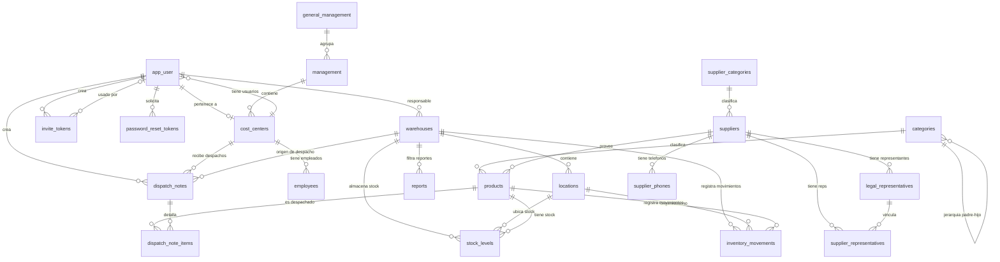

# Visco Orinoco (visco-sg) — Modelo de Base de Datos

Modelo relacional del sistema **sin** el flujo de compras: se excluyen requisiciones (`requisitions`, `requisition_items`), órdenes de compra (`purchase_orders`, `purchase_order_items`) y las tablas ligadas a PO (`good_receipts`, `good_receipt_items`, `invoices`, `invoice_items`).

---

## Diagrama ER

---

## Tablas

### 1. `app_user`

Usuarios del sistema (autenticación JWT).

| Columna | Tipo | Constraints |
|---------|------|-------------|
| `id` | `uuid` | Primary |
| `email` | `varchar` | Unique |
| `name` | `varchar` | Nullable |
| `password` | `varchar` | |
| `role` | `varchar` | |
| `is_active` | `bool` | |
| `cost_center_id` | `int8` | FK → `cost_centers.id` |
| `profile_picture_url` | `varchar` | Nullable |

### 2. `invite_tokens`

Tokens de invitación de un solo uso.

| Columna | Tipo | Constraints |
|---------|------|-------------|
| `id` | `uuid` | Primary |
| `token` | `varchar` | Unique |
| `email` | `varchar` | |
| `intended_role` | `varchar` | |
| `cost_center_id` | `int8` | Nullable, FK → `cost_centers.id` |
| `created_by_id` | `uuid` | FK → `app_user.id` |
| `created_at` | `timestamp` | |
| `expires_at` | `timestamp` | |
| `used_at` | `timestamp` | Nullable |
| `used_by_user_id` | `uuid` | Nullable, FK → `app_user.id` |
| `revoked` | `bool` | |

### 3. `password_reset_tokens`

Tokens de restablecimiento de contraseña.

| Columna | Tipo | Constraints |
|---------|------|-------------|
| `id` | `uuid` | Primary |
| `token` | `varchar` | Unique |
| `user_id` | `uuid` | FK → `app_user.id` |
| `created_at` | `timestamp` | |
| `expires_at` | `timestamp` | |
| `used_at` | `timestamp` | Nullable |

### 4. `warehouses`

Almacenes.

| Columna | Tipo | Constraints |
|---------|------|-------------|
| `id` | `int8` | Primary Identity |
| `name` | `varchar` | Unique |
| `description` | `varchar` | |
| `physical_address` | `varchar` | |
| `sap_center_code` | `varchar` | Nullable |
| `is_active` | `bool` | |
| `responsible_user_id` | `uuid` | FK → `app_user.id` |
| `created_at` | `timestamp` | Nullable |
| `updated_at` | `timestamp` | Nullable |

### 5. `locations`

Ubicaciones internas de un almacén.

| Columna | Tipo | Constraints |
|---------|------|-------------|
| `id` | `int8` | Primary Identity |
| `location_code` | `varchar` | Nullable, Unique |
| `warehouse_id` | `int8` | FK → `warehouses.id` |
| `is_active` | `bool` | |
| `created_at` | `timestamp` | Nullable |
| `updated_at` | `timestamp` | Nullable |

### 6. `Locations` (importación / catálogo externo)

Catálogo plano de productos/locaciones proveniente de SAP (sin PK).

| Columna | Tipo | Constraints |
|---------|------|-------------|
| `sap_code` | `varchar` | Nullable |
| `sku` | `text` | Nullable |
| `name` | `text` | Nullable |
| `uom` | `varchar` | Nullable |
| `location` | `varchar` | Nullable |

### 7. `products`

Catálogo de productos.

| Columna | Tipo | Constraints |
|---------|------|-------------|
| `id` | `int8` | Primary |
| `name` | `varchar` | |
| `description` | `varchar` | Nullable |
| `internal_code` | `varchar` | Unique |
| `sap_code` | `varchar` | Unique |
| `sku` | `varchar` | |
| `uom` | `varchar` | |
| `reorder_point` | `numeric` | |
| `max_stock` | `numeric` | Nullable |
| `is_active` | `bool` | |
| `category_id` | `int8` | Nullable, FK → `categories.id` |
| `supplier_id` | `int8` | Nullable, FK → `suppliers.id` |
| `created_at` | `timestamp` | Nullable |
| `updated_at` | `timestamp` | Nullable |
| `version` | `int8` | |

### 8. `categories`

Categorías jerárquicas de productos.

| Columna | Tipo | Constraints |
|---------|------|-------------|
| `id` | `int8` | Primary Identity |
| `name` | `varchar` | |
| `parent_id` | `int8` | Nullable, FK → `categories.id` |
| `created_at` | `timestamp` | Nullable |
| `updated_at` | `timestamp` | Nullable |

### 9. `suppliers`

Proveedores (soft-delete).

| Columna | Tipo | Constraints |
|---------|------|-------------|
| `id` | `int8` | Primary Identity |
| `name` | `varchar` | Unique |
| `email` | `varchar` | Unique |
| `description` | `text` | |
| `address` | `text` | |
| `currency` | `varchar` | |
| `tax_id` | `varchar` | Nullable |
| `sap_code` | `varchar` | Nullable |
| `category_id` | `int8` | Nullable, FK → `supplier_categories.id` |
| `is_active` | `bool` | |
| `deleted_at` | `timestamp` | Nullable |
| `created_at` | `timestamp` | |
| `updated_at` | `timestamp` | |

### 10. `supplier_categories`

Categorías de proveedores.

| Columna | Tipo | Constraints |
|---------|------|-------------|
| `id` | `int8` | Primary |
| `name` | `varchar` | |
| `description` | `text` | Nullable |
| `is_active` | `bool` | |
| `created_at` | `timestamp` | |
| `updated_at` | `timestamp` | |

### 11. `supplier_phones`

Teléfonos de proveedor (PK compuesta).

| Columna | Tipo | Constraints |
|---------|------|-------------|
| `supplier_id` | `int8` | Primary, FK → `suppliers.id` |
| `phone_number` | `varchar` | Primary |

### 12. `legal_representatives`

Representantes legales de proveedores.

| Columna | Tipo | Constraints |
|---------|------|-------------|
| `id` | `int8` | Primary Identity |
| `full_name` | `varchar` | |
| `supplier_id` | `int8` | Nullable, FK → `suppliers.id` |

### 13. `supplier_representatives`

Relación N:M entre proveedores y representantes legales.

| Columna | Tipo | Constraints |
|---------|------|-------------|
| `supplier_id` | `int8` | Primary, FK → `suppliers.id` |
| `representative_id` | `int8` | Primary, FK → `legal_representatives.id` |

### 14. `general_management`

Gerencia general.

| Columna | Tipo | Constraints |
|---------|------|-------------|
| `id` | `int8` | Primary |
| `code` | `varchar` | Unique |
| `description` | `varchar` | |
| `created_at` | `timestamp` | Nullable |
| `updated_at` | `timestamp` | Nullable |

### 15. `management`

Gerencias dependientes de una gerencia general.

| Columna | Tipo | Constraints |
|---------|------|-------------|
| `id` | `int8` | Primary |
| `code` | `varchar` | Unique |
| `description` | `varchar` | |
| `general_management_id` | `int8` | FK → `general_management.id` |
| `created_at` | `timestamp` | Nullable |
| `updated_at` | `timestamp` | Nullable |

### 16. `cost_centers`

Centros de costo.

| Columna | Tipo | Constraints |
|---------|------|-------------|
| `id` | `int8` | Primary |
| `code` | `varchar` | Unique |
| `full_description` | `varchar` | |
| `division_description` | `varchar` | Nullable |
| `is_active` | `bool` | |
| `management_id` | `int8` | FK → `management.id` |

### 17. `employees`

Empleados (tallas de uniforme).

| Columna | Tipo | Constraints |
|---------|------|-------------|
| `id` | `int8` | Primary |
| `full_name` | `varchar` | |
| `document_number` | `varchar` | Unique |
| `shirt_size` | `varchar` | Nullable |
| `pants_size` | `varchar` | Nullable |
| `shoes_size` | `varchar` | Nullable |
| `gender` | `varchar` | Nullable |
| `cost_center_id` | `int8` | Nullable, FK → `cost_centers.id` |
| `location` | `text` | Nullable |
| `is_active` | `bool` | |
| `created_at` | `timestamp` | Nullable |
| `updated_at` | `timestamp` | Nullable |

### 18. `stock_levels`

Niveles de stock por producto y ubicación.

| Columna | Tipo | Constraints |
|---------|------|-------------|
| `id` | `int8` | Primary Identity |
| `current_stock` | `numeric` | |
| `pending_stock` | `numeric` | |
| `product_id` | `int8` | Nullable, FK → `products.id` |
| `warehouse_id` | `int8` | Nullable, FK → `warehouses.id` |
| `location_id` | `int8` | Nullable, FK → `locations.id` |
| `version` | `int8` | Nullable |
| `created_at` | `timestamp` | Nullable |
| `updated_at` | `timestamp` | Nullable |

### 19. `inventory_movements`

Bitácora de movimientos de inventario.

| Columna | Tipo | Constraints |
|---------|------|-------------|
| `id` | `int8` | Primary Identity |
| `created_at` | `timestamp` | |
| `quantity` | `numeric` | |
| `reason` | `varchar` | Nullable |
| `type` | `varchar` | |
| `entry_unit_price` | `numeric` | Nullable |
| `exit_unit_price` | `numeric` | Nullable |
| `product_id` | `int8` | FK → `products.id` |
| `created_by_id` | `uuid` | FK → `app_user.id` |
| `from_location_id` | `int8` | Nullable, FK → `locations.id` |
| `to_location_id` | `int8` | Nullable, FK → `locations.id` |
| `location_id` | `int8` | Nullable, FK → `locations.id` |
| `from_warehouse_id` | `int8` | Nullable, FK → `warehouses.id` |
| `to_warehouse_id` | `int8` | Nullable, FK → `warehouses.id` |

### 20. `dispatch_notes`

Notas de despacho (salida de inventario).

| Columna | Tipo | Constraints |
|---------|------|-------------|
| `id` | `int8` | Primary |
| `dispatch_number` | `varchar` | Unique |
| `warehouse_id` | `int8` | FK → `warehouses.id` |
| `withdrawn_by_id` | `int8` | Nullable, FK → `employees.id` |
| `cost_center_id` | `int8` | FK → `cost_centers.id` |
| `notes` | `varchar` | Nullable |
| `created_at` | `timestamp` | |
| `created_by_id` | `uuid` | FK → `app_user.id` |
| `version` | `int8` | |

### 21. `dispatch_note_items`

Ítems de una nota de despacho.

| Columna | Tipo | Constraints |
|---------|------|-------------|
| `id` | `int8` | Primary |
| `dispatch_note_id` | `int8` | FK → `dispatch_notes.id` |
| `product_id` | `int8` | FK → `products.id` |
| `quantity` | `numeric` | |
| `exit_unit_price` | `numeric` | Nullable |

### 22. `reports`

Reportes generados.

| Columna | Tipo | Constraints |
|---------|------|-------------|
| `id` | `int8` | Primary |
| `name` | `varchar` | |
| `description` | `text` | Nullable |
| `type` | `varchar` | |
| `status` | `varchar` | |
| `format` | `varchar` | |
| `generated_at` | `timestamp` | Nullable |
| `start_date` | `timestamp` | Nullable |
| `end_date` | `timestamp` | Nullable |
| `filters` | `jsonb` | Nullable |
| `file_path` | `varchar` | Nullable |
| `file_size` | `int8` | Nullable |
| `record_count` | `int4` | Nullable |
| `search` | `varchar` | Nullable |
| `created_by` | `varchar` | Nullable |
| `created_at` | `timestamp` | Nullable |
| `updated_at` | `timestamp` | Nullable |
| `active` | `bool` | |
| `warehouse_id` | `int8` | Nullable, FK → `warehouses.id` |
| `category_id` | `int8` | Nullable, FK → `categories.id` |

### 23. `scheduled_reports`

Reportes programados.

| Columna | Tipo | Constraints |
|---------|------|-------------|
| `id` | `int8` | Primary |
| `name` | `varchar` | |
| `report_type` | `varchar` | |
| `frequency` | `varchar` | |
| `format` | `varchar` | |
| `recipient_emails` | `text` | Nullable |
| `filter_config` | `jsonb` | Nullable |
| `schedule_time` | `time` | Nullable |
| `schedule_day_of_week` | `int2` | Nullable |
| `schedule_day` | `int4` | Nullable |
| `last_executed_at` | `timestamp` | Nullable |
| `next_execution_at` | `timestamp` | Nullable |
| `enabled` | `bool` | |
| `created_at` | `timestamp` | Nullable |
| `updated_at` | `timestamp` | Nullable |

---

## Notas

- **Ubicación geográfica vs. inventario**: existen dos tablas `locations`/`Locations`. La de inventario es `locations` (con FK a `warehouses`); `Locations` es un catálogo externo plano sin PK.
- **Soft-delete**: `suppliers` usa `deleted_at`.
- **Optimistic locking**: `products`, `stock_levels`, `dispatch_notes` y `reports` usan `version`.
- **Jerarquía de negocio**: `general_management` → `management` → `cost_centers` → `app_user`/`employees`.
- **Flujo excluido**: el módulo de compras completo (requisiciones, PO, recepciones y facturación).
